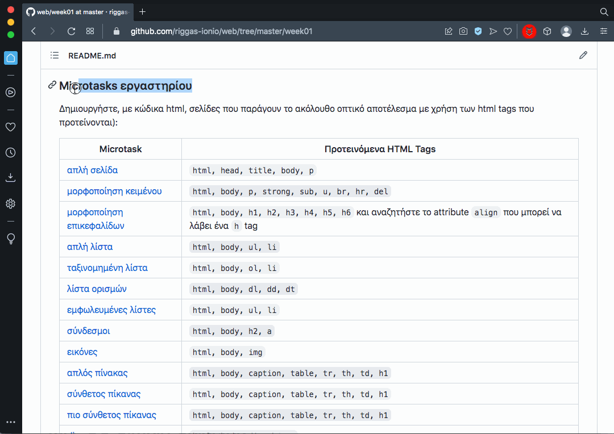

## Τεχνολογίες Διαδικτύου - εργαστήριο #2

### Cascading Style Sheets (CSS) και HTML

Σκοπός του πρώτου εργαστηρίου είναι η εξοικείωση με την τεχνολογία μορφοποίησης ιστοσελίδων CSS και η περαιτέρω εξοικείωση με την HTML.  
Η CSS έχει σκοπό να διαχωρίσει τη _δομή_ ιστοσελίδας (html) από τη _μορφοποίηση_ (css).

#### Δομή κανόνων CSS

Ο κανόνας `p { color: green; text-align: center;}` ορίζει σε ποια στοιχεία εφαρμόζεται (εδώ, όλα τα `p` tags) και ποιες μορφοποιήσεις εφαρμόζονται (εδώ, χρώματος γραμματοσειράς και στοίχισης).

#### Επιλογείς CSS (selectors)

**Βασικοί επιλογείς:**
* Element ή tag selector, πχ `p`:  
    - `p { color: green; text-align: center;}`
        - Επιλογή όλων των στοιχείων με το συγκεκριμένο tag
* ID selector, με αξιοποίηση χαρακτήρα `#` και ορισμό `id` attribute:
    - `#para1 { color: green; text-align: center;}`
        - Επιλογή μόνο του στοιχείου `
Text
`
* Class selector, με αξιοποίηση χαρακτήρα `.` και ορισμό ενός class, πχ `.greenparagraph`:  
    - `.greenparagraph { color: green; text-align: center;}`
        - Επιλογή όλων τα οποία δηλώνουν (πιθανά μεταξύ άλλων) την οριζόμενη κλάση, όπως `
Text
`

**Προχωρημένοι επιλογείς:**

* Attribute selector:
    - `a[target] { color: red; }`
        - Επιλογή μόνο των στοιχείου με το συγκεκριμένο tag (`a`) τα οποία έχουν και συγκεκριμένο attribute (`target`), πχ `<a href="#" target="_blank">Text</a>`
        - υποστηρίζονται και πιο εξειδικευμενοι επιλογείς οι οποίοι συνδυάζουν attributes και τιμές αυτών
* Pseudo-Class selector, με αξιοποίηση χαρακτήρα `:` και επιλογή καταστάσεων στις οποίες μπορεί να βρεθεί ένα στοιχείο, πχ `a:hover`:  
    - `a:hover { background-color: yellow; }`
        - Εφαρμογή σε στοιχεία με το συγκεκριμένο tag (`a`) όταν το ποντίκι είναι πάνω τους (ψευδοκλάση `hover`)
* Pseudo-Element selector, με αξιοποίηση χαρακτήρα `::` και επιλογή συγκεκριμένων υπο-στοιχείων, πχ `li::last-child `:  
    - `li:last-child { background-color: yellow; }`
        - Εφαρμογή στο τελευταίο `li` στοιχείο μιας λίστας
* Συνδυασμοί, με αξιοποίηση χαρακτήρα `>` για την επιλογή συγκεκριμένων υπο-στοιχείων, πχ `p > span`
    - `p > span { font-style: italic; }`
        - Εφαρμογή στα στοιχεία `span` τα οποία περιλαμβάνονται μέσα σε στοιχεία `p`

#### Κλιμάκωση, εξειδίκευση και κληρονομικότητα

Όταν περισσότεροι από έναν κανόνες μπορούν να εφαρμοστούν σε ένα στοιχείο για τη μορφοποίησή του, εφαρμόζονται οι ιδιότητες της Κλιμάκωσης, της Εξειδίκευσης και της Κληρονομικότητας.

Μπορείτε να κάνετε debug και να εντοπισετε ποιο κανόνας υπερισχύει ή ποιος κανόνας προβλέπει μια μορφοποίηση που βλέπετε μέσα από το εργαλείο Element Inspection που παρέχουν οι περισσότεροι browsers:

### Microtasks εργαστηρίου

Δημιουργήστε, με κώδικα html & css, σελίδες που παράγουν το ακόλουθο οπτικό αποτέλεσμα με χρήση των html tags και των css attributes που προτείνονται **(i)** με ενσωματωμένο κώδικα (inline CSS), **(ii)** με CSS κώδικα στην κεφαλίδα της σελίδας και **(iii)** με εξωτερικό CSS κώδικα:

1. [μορφοποίηση χρώματος υποβάθρου](./microtasks/01_background.png)  
  html tags: `html, head, meta, style, body, h1, h2, p`  
  css attributes: `background-color`
0. [μορφοποίηση υποβάθρου με χρήση εικόνας](./microtasks/01_background_image.png)  
  html tags: `html, head, meta, style, body, h1, h2, p`  
  css attributes: `background-color, background-image, background-repeat`  
  color: `#B9E0A5`
0. [μορφοποίηση περιγραμμάτων](./microtasks/03_borders.png)  
  html tags: `html, head, meta, style, body, h1, h2, p`  
  css attributes: `border-color, border-style, border-width, border-left-style, border-right-style, border-top-style, border-bottom-style`
0. [μορφοποίηση εξωτερικών περιθωρίων (margin)](./microtasks/04_margins.png)  
  html tags: `html, head, meta, style, body, h1, h2, p`  
  css attributes: `margin`  
  Επιθυμητά περιθώρια:  

| Tag | Πάνω | Κάτω | Αριστερά | Δεξιά |
|-----|-----:|-----:|---------:|------:|
| `h1`| 10px | 40px |     50px |  50px |
| `h2`|  5px | 20px |     50px |  50px |
| `p` |  0px | 10px |     20px |  20px |

5. [μορφοποίηση εξωτερικών περιθωρίων (padding)](./microtasks/05_padding.png)  
  html tags: `html, head, meta, style, body, h1, h2, p`  
  css attributes: `padding`  
  Επιθυμητά περιθώρια:  

| Tag | Πάνω | Κάτω | Αριστερά | Δεξιά |
|-----|-----:|-----:|---------:|------:|
| `h1`| 10px | 10px |     25px |  25px |
| `h2`|  5px |  5px |     10px |  10px |
| `p` |  5px |  5px |      5px |   5px |

6. [μορφοποίηση πλάτους και ύψους](./microtasks/06_width.png)  
  html tags: `html, head, meta, style, body, h1, h2, p, div`  
  css attributes: `width, height`
0. [μορφοποίηση κειμένου](./microtasks/07_text.png)  
  html tags: `html, head, meta, style, body, h1, h2, p, div, span, a`  
  css attributes: `text-align, color, letter-spacing, text-shadow, font-family`
0. [μορφοποίηση αναδίπλωσης](./microtasks/08_float.png)  
  html tags: `html, head, meta, style, body, h1, h2, p, div, span, a`  
  css attributes: `float`
0. [μορφοποίηση τοποθέτησης](./microtasks/09_position.png)  
  html tags: `html, head, meta, style, body, h1, h2, p, div, span, a, br, img`  
  css attributes: `position, top, right`
0. [μορφοποίηση επιπέδων και διαφάνειας](./microtasks/10_visibility.png)  
  html tags: `html, head, meta, style, body, h1, h2, p`  
  css attributes: `z-index, opacity`

### Task εβδομάδας

Αναδημιουργήστε το βιογραφικό σας με χρήση html και μορφοποίηση css (με εξωτερικό συνδεδεμένο αρχείο css) και με όνομα αρχείου cv.html, αξιοποιώντας τις παραπάνω τεχνικές.  
Τροποποιήστε το αρχείο css και παρατηρήστε πώς αλλάζει η μορφή του βιογραφικού σας χωρίς να αλλάζει το html αρχείο.

**_Help:_**
* Εργαστηριακές ασκήσεις δικτύων Η/Υ, **HTML και CSS**, Κωνσταντίνος Χειλάς, Αλέξανδρος Βακαλούδης, Αναστάσιος Πολίτης  
  https://repository.kallipos.gr/bitstream/11419/1775/2/05_chapter_12.pdf
* CSS basics από Mozilla MDN  
  https://developer.mozilla.org/en-US/docs/Learn/Getting_started_with_the_web/CSS_basics
* Cascading Style Sheets Cheatsheet από stanford.edu
  https://web.stanford.edu/group/csp/cs21/csscheatsheet.pdf
